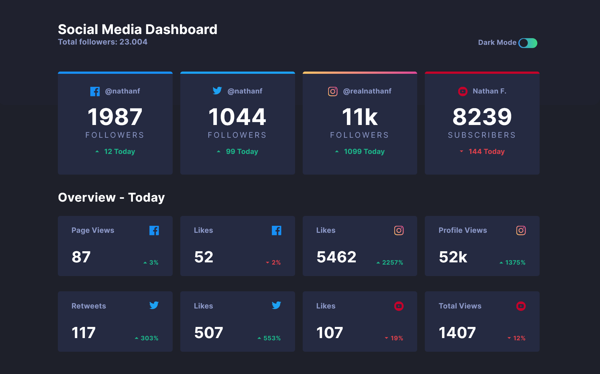
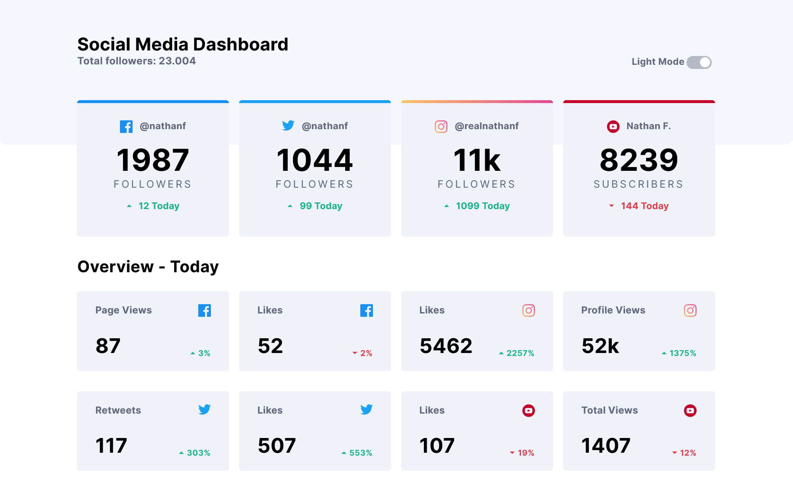
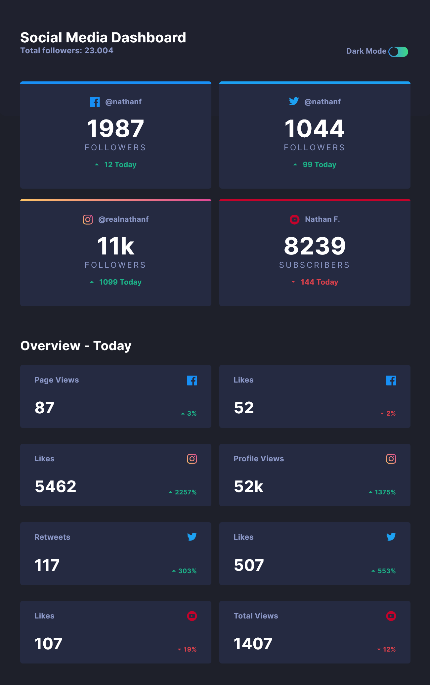
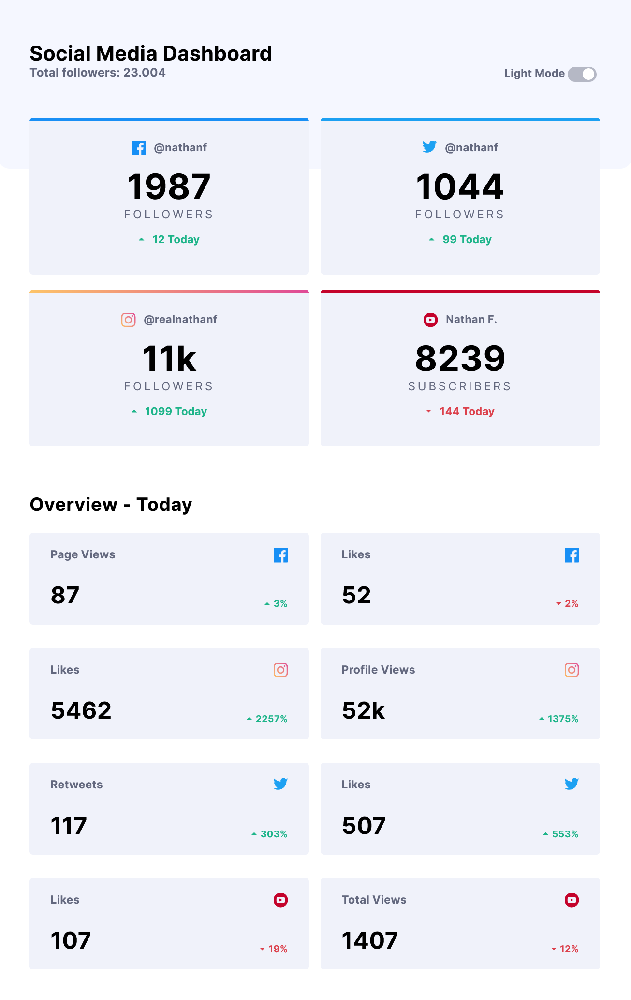
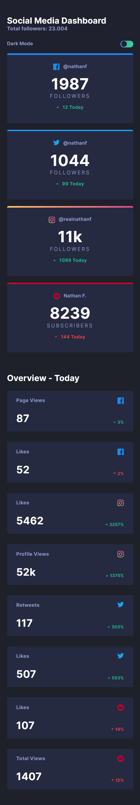
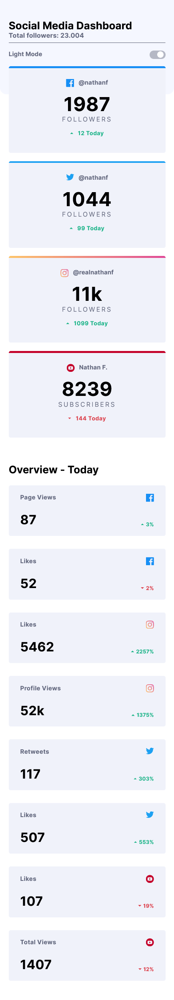

# Social media dashboard with theme switcher

## Table of contents

- [Overview](#overview)
  - [The challenge](#the-challenge)
  - [Screenshot](#screenshot)
  - [Links](#links)
- [My process](#my-process)
  - [Built with](#built-with)
- [Author](#author)

## Overview

Users should be able to:

- View the optimal layout for the site depending on their device's screen size
- See hover states for all interactive elements on the page
- Toggle color theme to their preference

### Screenshot

### Links

- GitHub URL: https://github.com/Nesh00/social-media-dashboard
- Live Site URL: https://social-media-dashboard-nenad.netlify.app/

## My process

### Built with

- Semantic HTML5 markup
- CSS custom properties
- Flexbox
- Sass
- JavaScript

## Author

- LinkedIn - https://www.linkedin.com/in/nenad-tsvetanovski-3101b474/
- Twitter - https://twitter.com/nenad37452460
